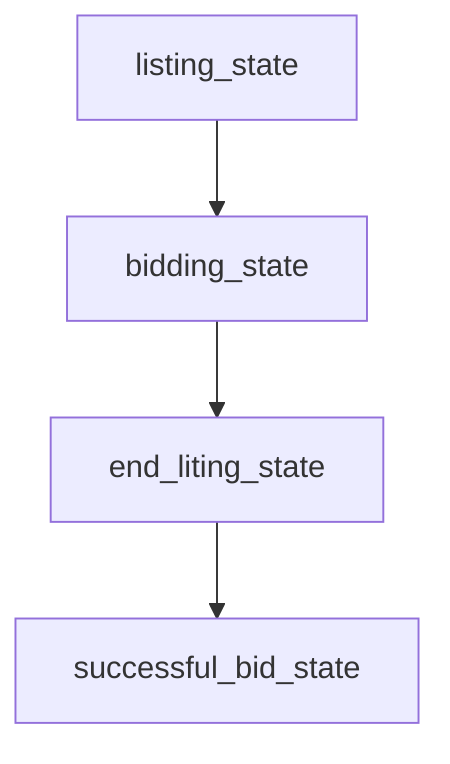
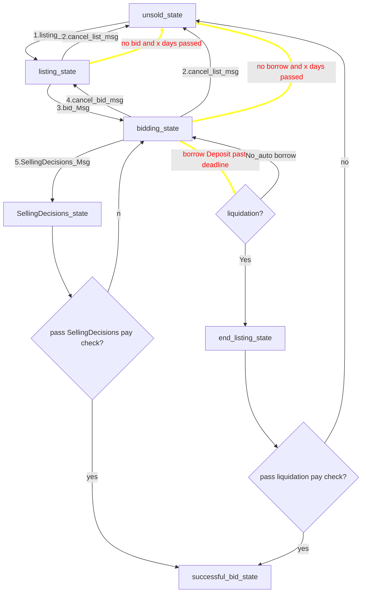
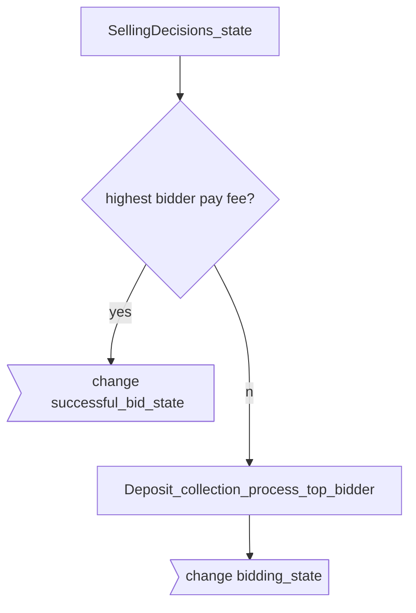
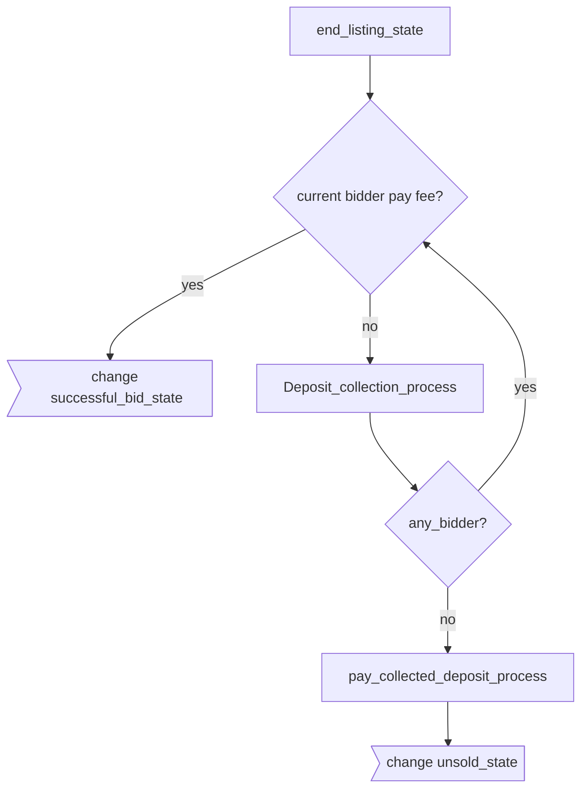
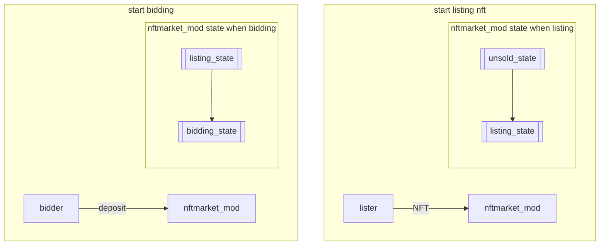
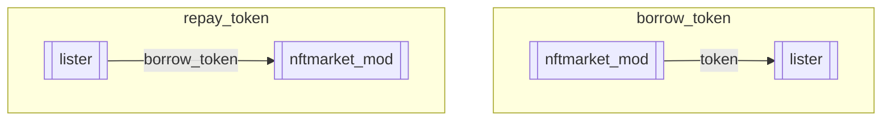
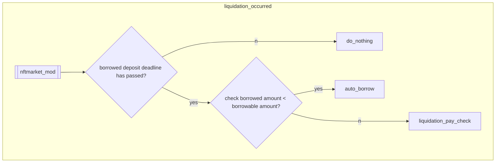
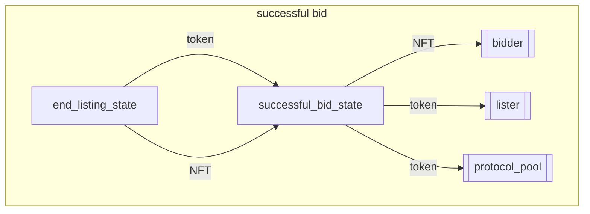

# state

The `x/nftmarket` module keeps state of n primary objects:

## basic lithing abstract flow



# basic listing

## listing state

|No |state                |Description.                                                                                                                                         |
|---|---------------------|-----------------------------------------------------------------------------------------------------------------------------------------------------|
|1  |unsold_state         |NFT not listed for listing                                                                                                                           |
|2  |listing_state        |It's the state of listing.                                                                                                                           |
|3  |bidding_state        |It's state that there are bids in the listing                                                                                                        |
|4  |SellingDecision_state|It's state that the lister has decided to sell                                                                                                       |
|5  |end_listing_state    |The borrowing term of the DEPOSIT has been exceeded.                                                                                                 |
|6  |successful_bid_state |The lister has ended and the candidate bidder has paid for the item. The successful bidder and lister can exchange NFTs and tokens.                  |

### state change msg list

| ID  | Name                 |
| --- | -------------------- |
| 1   | listing Msg          |
| 2   | cancel list Msg      |
| 3   | bid Msg              |
| 4   | cancel bid Msg       |
| 5   | SellingDecision Msg  |
| 6   | pay listing fee Msg  |

### state flow
Yellow lines are automatically checked by protocol

### paycheck flow
#### SellingDecisions pay check flow



#### liquidation pay check flow



### listing Token and NFT flow

#### case. start listing and bidding



#### case. bidding





### bidding cancel

```mermaid
flowchart TD
subgraph bidding_cancel_bid
  cancel_bidder[[cancel_bidder]]
  check_borrow{lister borrow token?}
  check_your_deposit_use{cancel bidder deposit used?}

  check_borrow.-NO.-> bidding_state
  check_your_deposit_use--No--> bidding_state
  bidding_state----> delay_time_process
  check_borrow--Yes--> check_your_deposit_use
  check_your_deposit_use--Yes--> not_accept_cancel_bid
  delay_time_process --token--> cancel_bidder

end
```

### end listing



# late shipping nft listing

TODO: Describe the detailed flow
