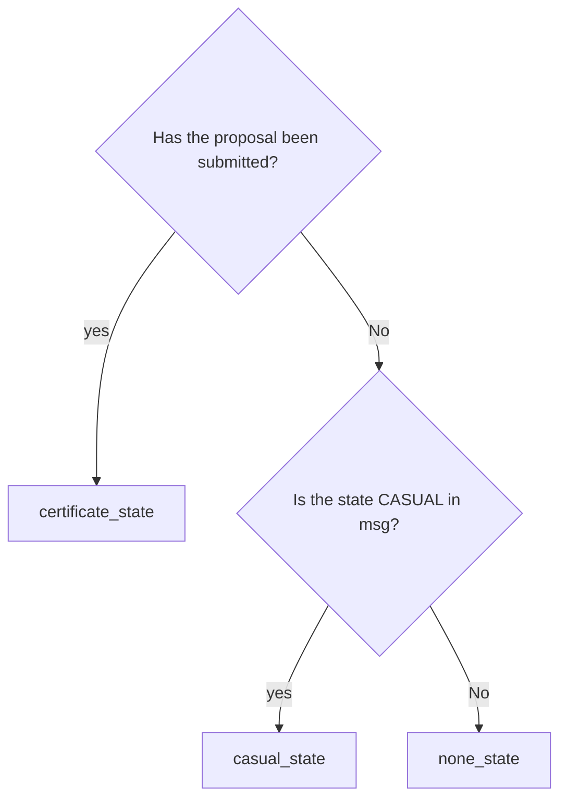

# Concepts

The `x/nft-certification` module implements the logic and status for the certification of collective NFT on UnUniFi for the fair NFT listing to the consumers.

## Status
**None**   
The `none` status is put when the NFTs are minted on UnUniFi.

**Casual**
The `casual` status is put when the specific Msg is send.

**Governance-certificated**   
The `governance-certificated` status is put when the specific governance proposal is passed.

## Logic   

# requirement

## basic

### Add status

- There are three type of the registration, which are none, casual and governance-certificated
- Casual status can be brought to any NFT by sending Msg
- Governance-certificated status can be brought by making the specific governance proposal   
    

### Remove status
- [WIP] Casual status removal process is in the consideration
- Governance-certificated status can be removed by making the specific governance proposal

