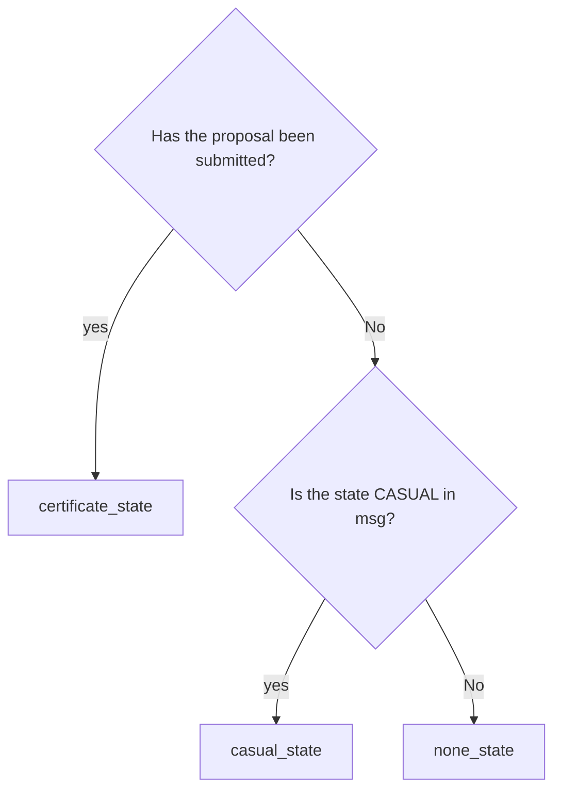

# Concepts

The `x/nft-certification` module implements the logic and status for the certification of NFTs on UnUniFi for the fair NFT listing to the consumers.

## Status   

## Logic   

# requirement

## basic

### add guarantee
1. 保証には、none, casual, certificateの3タイプがある
1. casualはmsgを使い誰でも認証することができる
1. casualはmsgを使い誰でも認証を削除することができる
1. certificateはproposalを提出し認証させることができる
1. certificateはproposalを提出し認証を削除、上書きすることができる

