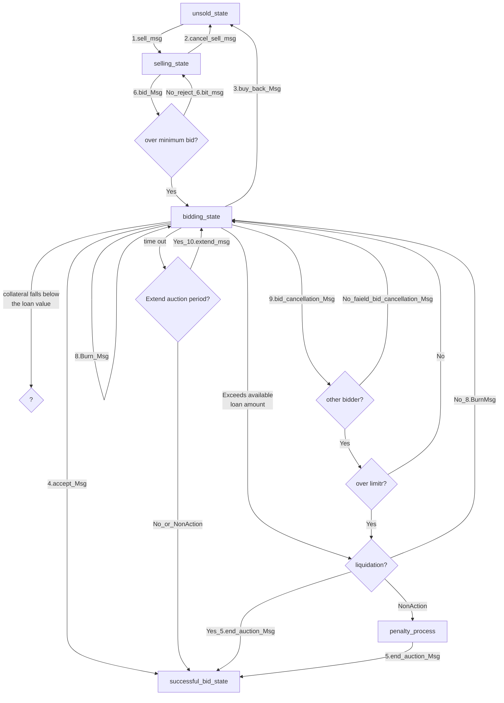

# state

The `x/nftmarket` module keeps state of n primary objects:

1. auction state.
1. bid balances.
1. NFT Ownership.
1. CDP balance using NFT.

## auction state
1. unsold_state
1. selling_state
1. bidding_state
1. liquidation_state
1. successful_bid_state

auction flow 

