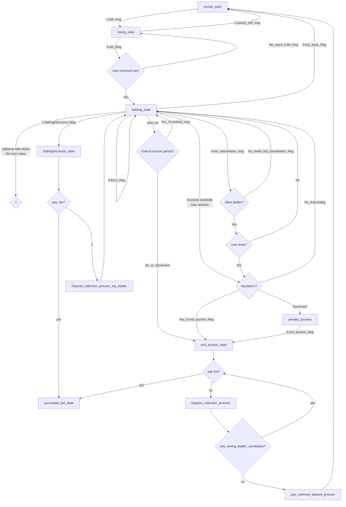
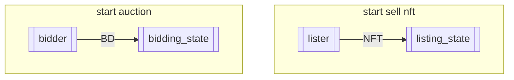
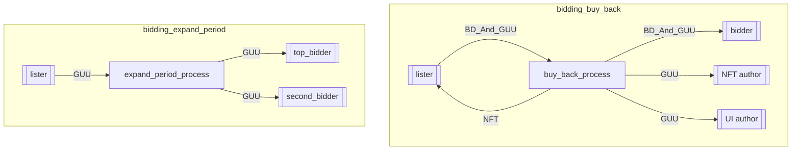
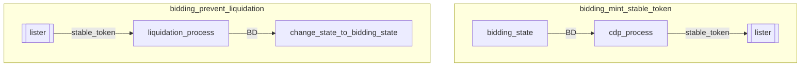
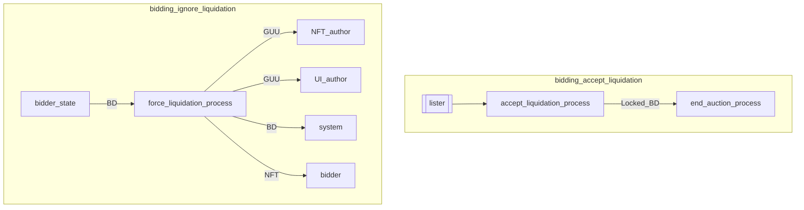
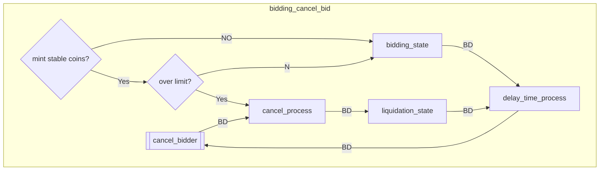
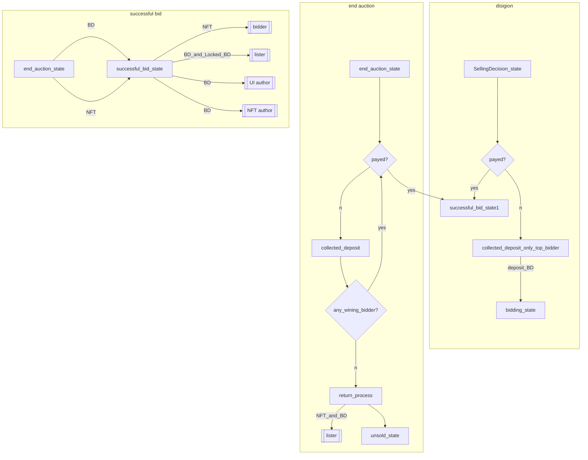

# state

The `x/nftmarket` module keeps state of n primary objects:

## auction state
1. unsold_state
    NFT not listed for auction
1. listing_state
1. bidding_state
1. SellingDecision_state
1. liquidation_state
1. end_auction_state
1. successful_bid_state

### msg list 

|ID |Name                         |
|---|-----------------------------|
|1  |sell Msg                     |
|2  |cancel sell Msg              |
|3  |buy back Msg                 |
|4  |SellingDecision Msg          |
|5  |end auction Msg              |
|6  |bid Msg                      |
|7  |mint stable coin Msg         |
|8  |burn stable coin Msg         |
|9  |bid cancellation Msg         |
|10 |extend Msg                   |
|11 |pay auction fee Msg          |

### auction flow 

### auction Token and NFT flow 
#### case. start acution

#### case. bidding 

### bidding cancel 
Bid cancellations will have a delay before the tokens are returned  
The time to return tokens for canceled bids can be determined at the time of the auction  

### end auction 

