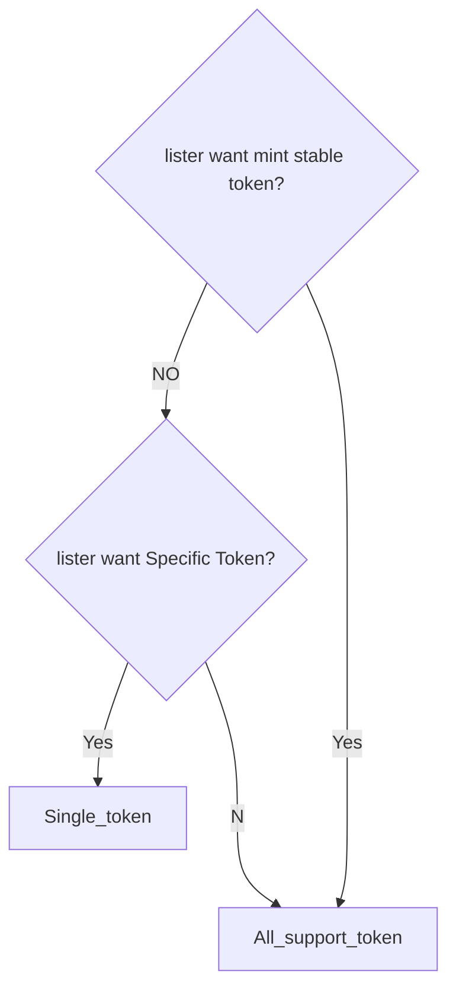
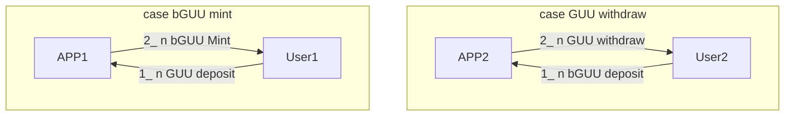

# tokens

## How to determine BD(Bidding Token) 
- BD can be any token if the lister designated the "minting synthetic assets" type auction
- BD can be only the token designated by the lister if the lister designated the "directly borrowing assets" type auction

## bidding reward 

## UnUniFi Synthetic assets

