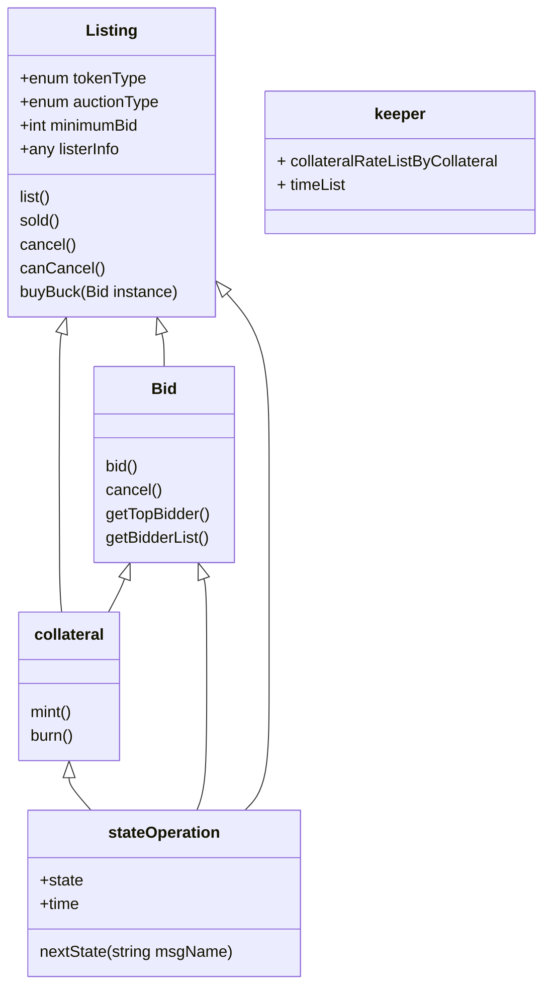

# class diagram

```mermaid
 classDiagram
      Listing <|-- collateral
      Listing <|-- Bid
      Bid <|-- collateral
      collateral <|-- stateOperation
      Bid <|-- stateOperation
      Listing <|-- stateOperation
      class Listing{
          +enum tokenType
          +enum auctionType
          +int minimumBid
          +any listerInfo
          list()
          sold()
          cancel()
          canCancel()
          buyBuck(Bid instance)
      }
      class Bid{
          bid()
          cancel()
          getTopBidder()
          getBidderList()
      }
      class collateral {
          mint()
          burn()
      }
      class stateOperation {
          +state
          +time
          nextState(string msgName)
      }
      class keeper{
          + collateralRateListByCollateral
          + timeList
      }
```

The collateralRateListByCollaterall is used for liquidation checks.  
timeList is used for auction closeout checks.   