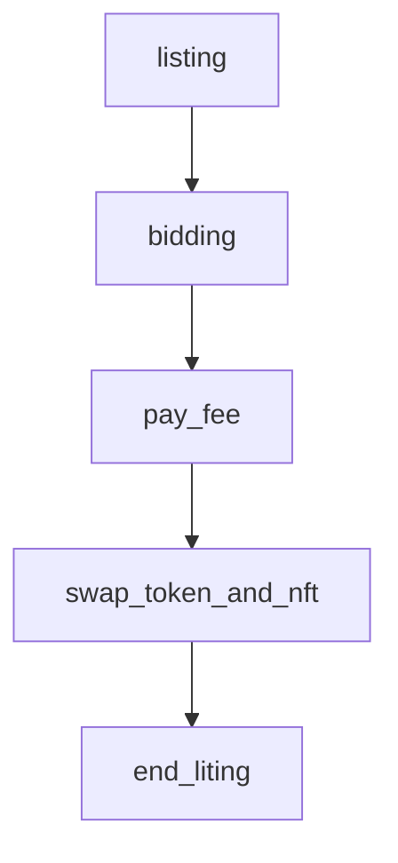
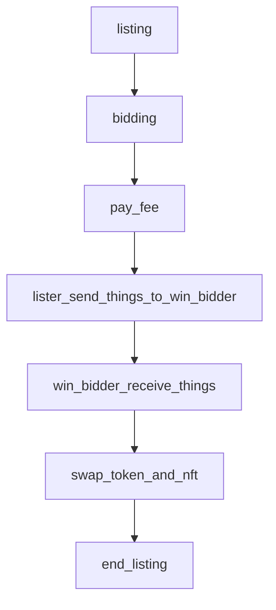
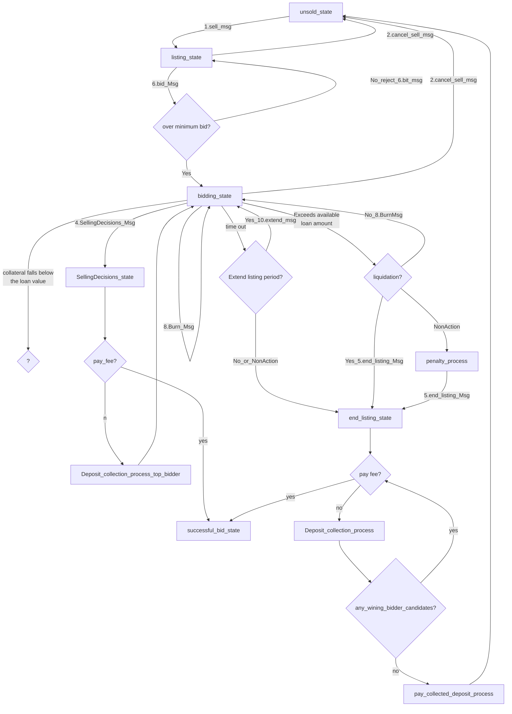
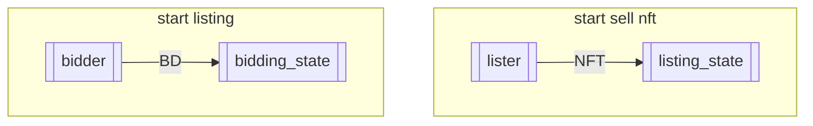
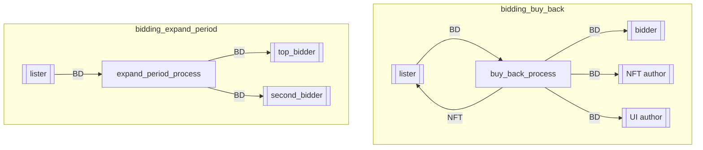
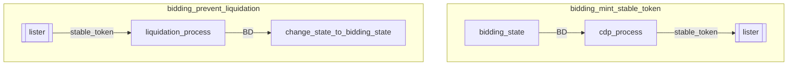
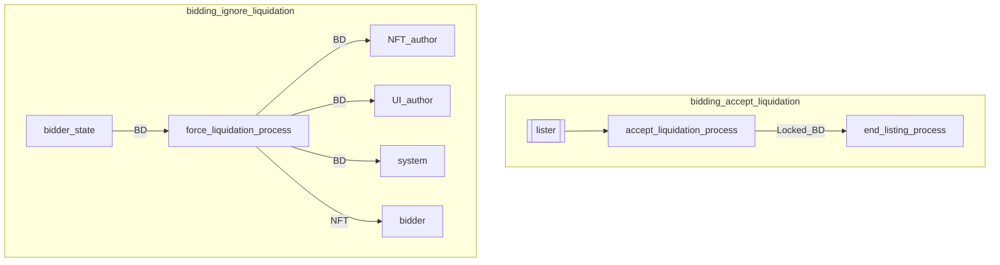
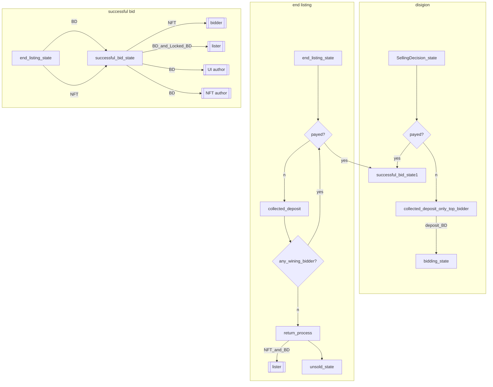

# state

The `x/nftmarket` module keeps state of n primary objects:

## basic lithing abstract flow



## late shipping lithing abstract flow



# basic listing

## listing state

|No |state                |Description.                                                                                                                                         |
|---|---------------------|-----------------------------------------------------------------------------------------------------------------------------------------------------|
|1  |unsold_state         |NFT not listed for listing                                                                                                                           |
|2  |listing_state        |It's the state of listing.                                                                                                                           |
|3  |bidding_state        |It's state that there are bids in the listing                                                                                                        |
|4  |SellingDecision_state|It's state that the lister has decided to sell                                                                                                       |
|5  |liquidation_state    |The value of the Denom used for bidding has dropped. Therefore, the collateral rate for the stabled coins issued by lister has exceeded the threshold|
|6  |end_listing_state    |It's just the state of the listing period has ended.                                                                                                 |
|7  |successful_bid_state |The lister has ended and the candidate bidder has paid for the item. The successful bidder and lister can exchange NFTs and tokens.                  |

### msg list

| ID  | Name                 |
| --- | -------------------- |
| 1   | sell Msg             |
| 2   | cancel sell Msg      |
| 3   | ------------         |
| 4   | SellingDecision Msg  |
| 5   | end listing Msg      |
| 6   | bid Msg              |
| 7   | mint stable coin Msg |
| 8   | burn stable coin Msg |
| 9   | bid cancellation Msg |
| 10  | extend Msg           |
| 11  | pay listing fee Msg  |

### listing flow



### listing Token and NFT flow

#### case. start listing



#### case. bidding







### bidding cancel

Bid cancellations will have a delay before the tokens are returned  
The time to return tokens for canceled bids can be determined at the time of the listing

```mermaid
flowchart TD
subgraph bidding_cancel_bid
  cancel_bidder[[cancel_bidder]]
  check_mint{lister mint stable coins?}
  check_limit{all bid deposit - cancel bid deposit < borrowed token amount?}

  check_mint.-NO.-> bidding_state
  check_limit--No--> bidding_state
  bidding_state--BD--> delay_time_process
  check_mint--Yes--> check_limit
  check_limit--Yes--> cancel_process
  cancel_process --BD--> bidding_state
  delay_time_process .-BD.-> cancel_bidder
  delay_time_process --decrease_BD_or_empty--> cancel_bidder

end
```

### end listing



# late shipping nft listing

TODO: Describe the detailed flow
