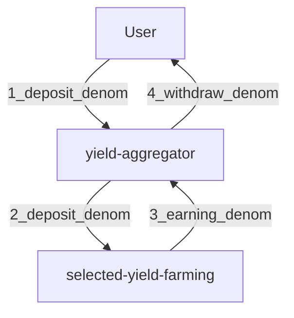

# Concepts

## introduction  

UnUniFi's NFTFi feature does not have an automatic earning function.

Users have to use NFTi's functionality to Borrow and invest on their own.

## about yield-aggregator (YA)

`yield-aggregator` module provides the function for yield aggregation.

It find the optimal target of funds for asset management (e.g. the highest interest rate pool).

`nft-marketmaker` module and CosmWasm contracts will call the keeper of this module.

NFTFi will be able to use this feature and automatically earning

## yield-aggregator abstract work flow

## Yield Farming(YF)

Yield farming is the process of using decentralized finance (DeFi) to maximize returns.

Users lend or borrow crypto on a DeFi platform and earn cryptocurrency in return for their services.

## DailyPercent

`yield-aggregator` computes the amount deposited with YF and the amount returned from YF
Let it be DailyPercent.

Annual percent rate (APR) and annual percent yield (APY) can be calculated with recent `n` (you can choose) days' `DailyPercent` data.

## Farming Order(FO)

YA can create complex investment strategies by combining multiple FOs.

Each FO operates on an event and determines the amount invested from a percentage of the balance

## Farming Order Event

Events that make the FO work

1. deposit msg with execute_orders flag thrown.
1. ExecuteOrders msg thrown.
1. When received the Denom from YF.
