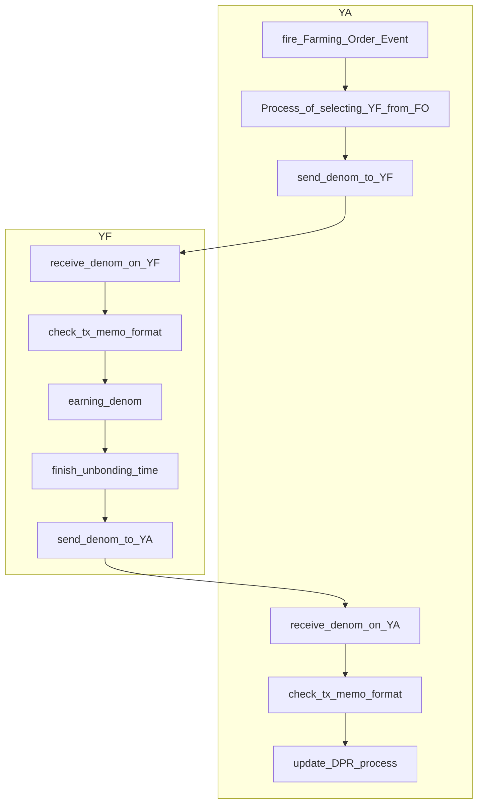

# Integrate Yield Farming

When Yield Farming is registered in the `yield-aggregator`, a Denom is automatically sent to that address.

The data will be entered in the memo of that Tx.

Operate the service with the received Denom based on that information.

Send the Denom back to the module within the Unbonding_time.

## abstract YA work flow



## send tx denom memo format

```json

{
  "info":{
    "version":"1",
    "chainId":"string",
  },
  "data":[
    {
      "id": "string",
      "amount": "[]cosmos.base.v0beta1.Coin",
      "targetId": "string",
      "unbonding_time": "string",
    }
  ]
}
```

## example

send 10000UGUU to YF from YA

```json

{
  "info":{
    "version":"1",
    "chainId":"ununifi-beta-test",
  },
  "data":[
    {
      "id": "b70236c2187194c34225e5ef6f853ffb",
      "amount": [
        {
          "denom":"uguu",
          "amount":10000,
        }
      ],
      "targetId": "1",
      "unbonding_time": "1.21e+6",//14days
    }
  ]
}
```

send 379UGUU to YA from YF

```json

{
  "info":{
    "version":"1",
    "chainId":"ununifi-beta-test",
  },
  "data":[
    {
      "id": "b70236c2187194c34225e5ef6f853ffb",
      "amount": [
        {
          "denom":"uguu",
          "amount":10038,
        }
      ],
      "targetId": "1",
      "unbonding_time": "1.21e+6",//14days
    }
  ]
}
```

DPR is valued at 10%.
