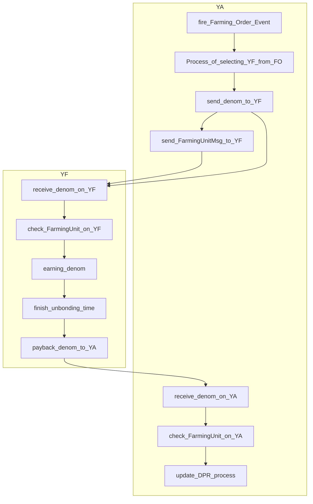

# Integrate Yield Farming

Introduction to integrating Yield Farming created from cosmwasm

When Yield Farming is registered in the `yield-aggregator`, a Denom is automatically sent to that address.

Then `yield-aggregator` send `FarmingUnitMsg` to Yield Farming.

Yield Farming operate the service with the received Msg based on that information.

Send the Denom back to the module with `AssetManagementAccountBankKeeper.PayBack` within the Unbonding_time.

## abstract YA work flow

